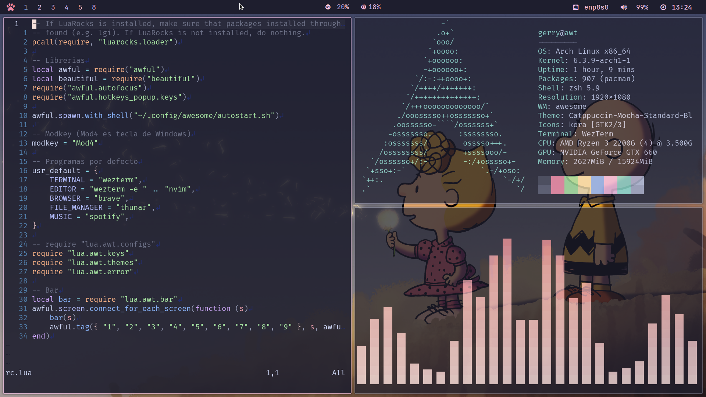

<div align="center">
    <h1><strong>AwesomeWM dotfiles</strong></h1>
    
</div>

# Instalacion
### Curl
```sh
curl -LO https://raw.githubusercontent.com/awtGerry/install-aw/master/install.sh
chmod +x install.sh
sudo ./install.sh
```
### Git
Requiere tener git instalado
```sh
git clone https://github.com/awtGerry/install-aw.git
sudo ./install.sh
```

# Programas
Todos los programas y dependencias se encuentran listados en [programs.csv](./programs.csv).

## NOTAS
- Se tiene que tener en cuenta que la instalacion borrara toda posible configuracion que exista en `~/.config` y tenga
conflicto con los programas que se usan en mis [dotfiles](https://github.com/awtgerry/dotfiles).
Si quiere mantener la configuracion del usuario sugiero hacer un backup o cambiar simplemente el nombre y luego regresar
para sobrescribirlo.

- Para instalaciones en artix linux es posible que se necesite activar repositorios de arch.
Leer la [wiki de artix](https://wiki.artixlinux.org/Main/Repositories) para ver como activarlos.

## NVIDIA drivers
El instalador no instalara los drivers para tarjetas de video.
Si se tiene una tarjeta de video Nvidia se necesitan instalar drivers "manualmente"
si son nuevas tarjetas (o no tan viejas) solo es ejecutar en una terminal el comando:
```sh
sudo pacman -S nvidia nvidia-utils opencl-nvidia
```
En algunos casos esto no sirve ya que instala `x` driver, entonces
es necesario buscar los drivers de tu tarjeta en [la pagina oficial de nvidia](https://www.nvidia.com/download/index.aspx).
En mi caso los drivers son los 470 se ejecuta este comando:
```sh
paru -S nvidia-470xx-dkms nvidia-470xx-utils opencl-nvidia-470xx
```

Reiniciar y el comando `nvidia-smi` debera mostrar un output

Finalmente agregar las lineas siguientes a `/usr/share/sddm/scripts/Xsetup`
```sh
xrandr --setprovideroutputsource modesetting NVIDIA-0
xrandr --auto
```
